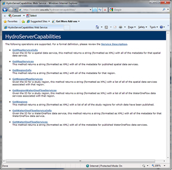

# HydroServer Capabilities
>
The HydroServer Capabilities Database, Configuration Tool, and Capabilities Web Service were created to allow administrators of HydroServers to publish the capabilities of their servers (i.e., the list of services that their HydroServer provides) in a standard way that can be automatically discovered by others. The development of these tools has several advantages. First, they make is so that a HydroServer is self describing. Through a single web service interface, all of the services published on that server and a metadata description for each can be obtained. This simplifies registration of HydroServer capabilities with regional HIS portals and the HIS Central metadata repository, and ensures that the services hosted on a HydroServer can be discovered through centralized search and discovery tools such as Hydroseek, HydroDesktop, and other HIS client applications.

## Software Manual
* [HydroServer Capabilities Software Manual](HydroServer Capabilities_HydroServerCapabilitiesSoftwareManual_8-26-2011.pdf)