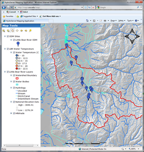

# HydroServer Map
>
The HydroServer Map is a Web application that was created for visualizing within a web browser the GIS and observational data services that have been published for a particular region or experimental watershed on a HydroServer. It was developed using the ESRI ArcGIS Server Application Developer's Framework and requires ArcGIS Server 9.3.1.

## Software Manual
* [HydroServer Map Software Manual](HydroServer Map_HydroServerMapSoftwareManual_8-26-2011.pdf)

## HydroServer Map Alternatives
Since the HydroServer Map Application uses the ArcGIS Server Application Developer's Framework (ADF), you must have ArcGIS Server installed to use it.  This is a constraint for some who do not have access to a license for ArcGIS Server.  There are alternatives to ArcGIS Server for publishing geospatial datasets as services.  One good example is GeoServer.  GeoServer has been successfully used by some HydroServer users as an alternative to ArcGIS Server.  Unfortunately, the HydroServer Map application will not work with GeoServer, but you can still publish your geospatial datasets.  Two documents have been provided by Piper McKinnon of the Niagara Peninsula Conservation Authority that may assist you in getting started with GeoServer.

* [NPCA GeoServer Implementation Documentation](HydroServer Map_NPCAGeoserverImplementation_20101116.pdf)
* [Installing Instances of Tomcat 6 on IIS](HydroServer Map_Installing_Instances_of_Tomcat_6_on_IIS.pdf)