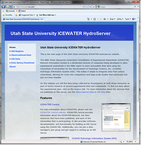

# HydroServer Website
>
The HydroServer Website is a Web application that was created to present the capabilities of a HydroServer. It is intended to present the list of regions for which data have been published, the list of observational data services hosted by the server, the list of spatial data services hosted by the server, and the relationships between services and the regions they represent.

The HydroServer Website connects to the HydroServer Capabilities database and automatically generates much of the content on its pages from content within the database. Because of this, HydroServer administrators can add new regions and services to their HydroServer Website simply by adding their descriptions to the HydroServer Capabilities database.

## Software Manual
* [HydroServer Website Software Manual](HydroServer Website_HydroServerWebsiteSoftwareManual_8-26-2011.pdf)