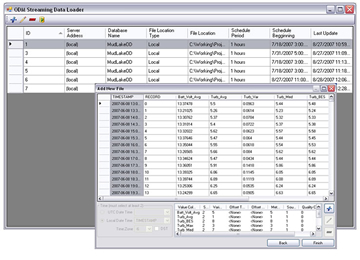

# ODM Streaming Data Loader
>
The ODM Streaming Data Loader (ODM SDL) was created to allow administrators of ODM databases to automate the process of loading their streaming sensor data from text files generated by their monitoring and telemetry system into an instance of the ODM. ODM SDL provides simple visual tools for mapping streaming data files to the ODM schema and for specifying all of the required metadata, which means that users do not need to perform any specialized programming to parse and load the data and that the data are fully qualified with valid metadata when they are loaded. Finally, the ODM SDL application can be scheduled as a Windows task to run on a user customized schedule. This means that loading of sensor data with multiple reporting frequencies can be run automatically and optimized according to a user defined schedule.

## Design Specifications Document
* [ODM SDL Design Specifications Document](ODM Streaming Data Loader_ODM_SDL_Design_Specifications.pdf)

## Software Manual
* [ODM SDL Software Manual](ODM Streaming Data Loader_ODMStreamingDataLoaderSoftwareManual_3-1-2012.pdf)