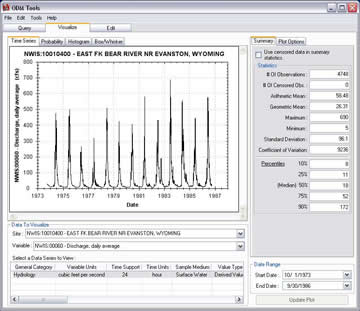

# ODM Tools
>
The ODM Tools application was created to allow administrators and users of ODM to visualize, manage, manipulate, edit, and export data that have been imported to their local instance of the ODM. The ODM Tools application is organized into three general areas: 1) query and export; 2) visualize; and 3) edit. The Query and export functionality allows users to find the data that they are interested in and export it to a simple format that can be used with a variety of analysis software. The Visualize functionality allows users to quickly plot and summarize data using a variety of plot types and descriptive statistics. The Edit capability of ODM Tools was designed to provide users with a simple set of tools that they can use to edit existing data series and to create new data series from existing data series.

The ODM Tools application has several advantages. First, ODM Tools protects the security and consistency of a work group HIS ODM database because it provides users with a set of automated tools for performing many of the most common database transactions. Second, ODM Tools allows users to export data from their ODM instance with an accompanying metadata file. This allows users to work with local copies of data series exported from their ODM database while preserving the provenance of the data via the metadata file. ODM Tools also provides a mechanism by which users can interact with the ODM database without having to learn the complexities of its relational structure. Last, for more advanced users, the source code of the ODM Tools application provides an example of how applications can be built on top of the CUAHIS HIS ODM.

The following documentation is available for ODM Tools. Please consult the software manual for instructions on how to install and use ODM Tools.

## Watch ODM Tools in action:
* [Query and Export Functionality](http://his.cuahsi.org/movies/QueryAndExport.avi)
* [Data Visualization Functionality](http://his.cuahsi.org/movies/Visualize.avi)

## Design Specifications
* [ODM Tools Design Specifications Document](http://his.cuahsi.org/documents/ODM_Tools_Design_Specifications.pdf)

## Software Manual
* [ODM Tools Software Manual](ODM Tools_ODMToolsSoftwareManual_3-1-2012.pdf)