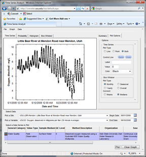

# Time Series Analyst
>
The HydroServer Time Series Analyst is a web application for visualizing and summarizing time series data stored in ODM databases on a HydroServer. It has a variety of plot types and descriptive statistics coupled with a graphical user interface for selecting data to be analyzed. TSA is a stand-alone web application that can be launched in a specific state by passing parameters to a custom calling interface via the URL string. TSA is capable of connecting to multiple ODM databases on a HydroServer. It supports both ODM 1.0 and ODM 1.1 databases. TSA was designed to use a direct SQL connection to each of the ODM databases on a HydroServer, and uses information stored in the HydroServer Capabilities database (server name, database name, userid, password) for those databases. The ODM SQL Server databases do not have to be connected to the same SQL Server instance.

## Software Manual
* [Time Series Analyst Software Manual](Time Series Analyst_HydroServerTSASoftwareManual_8-26-2011.pdf)